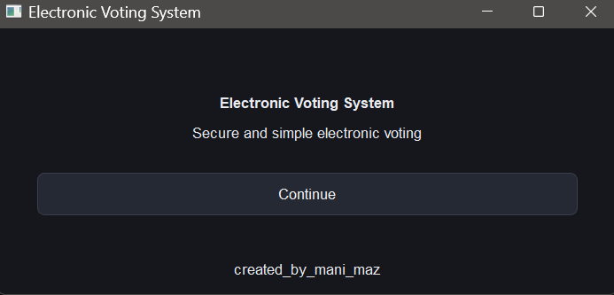
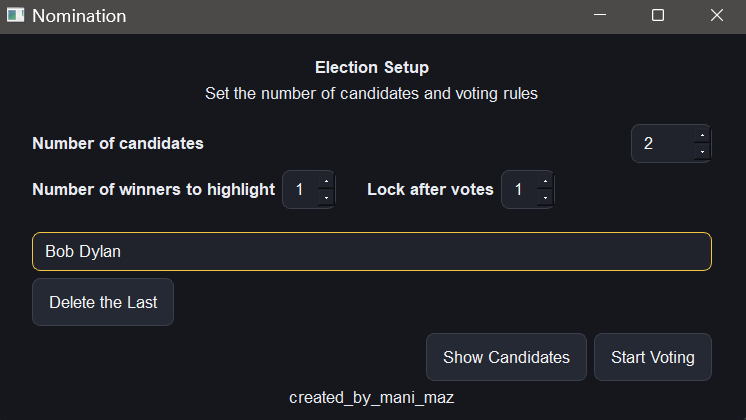
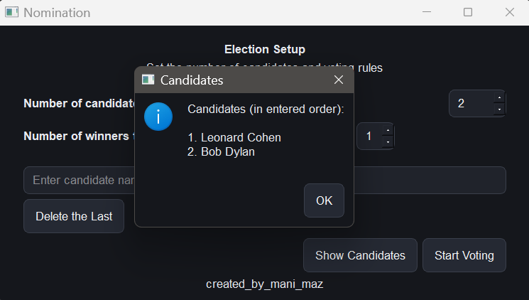
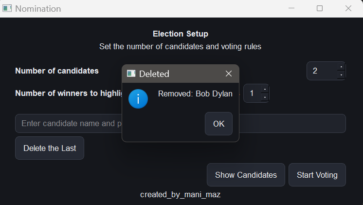
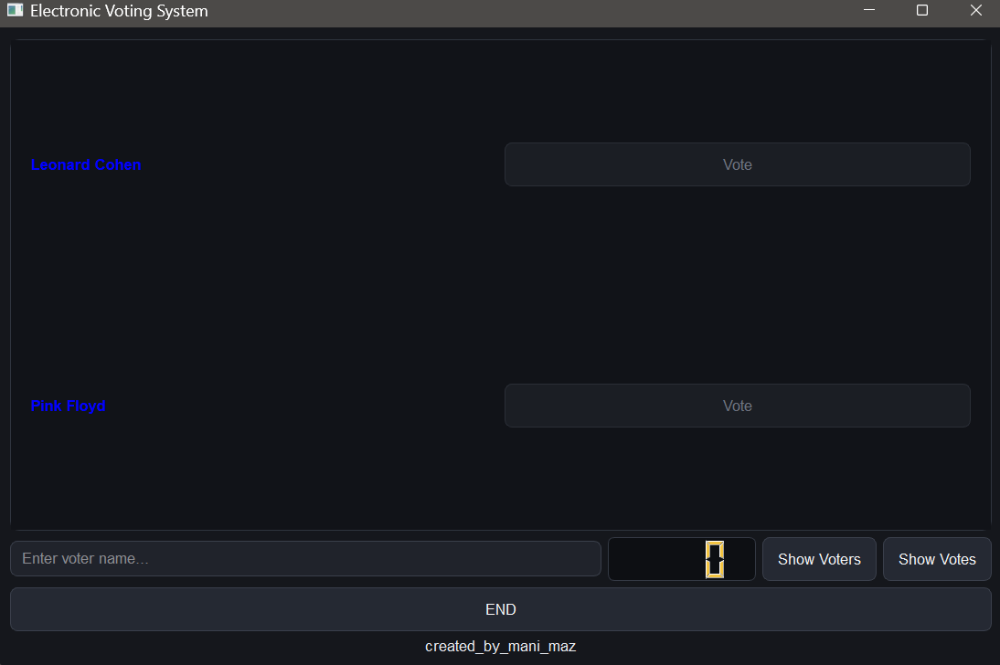
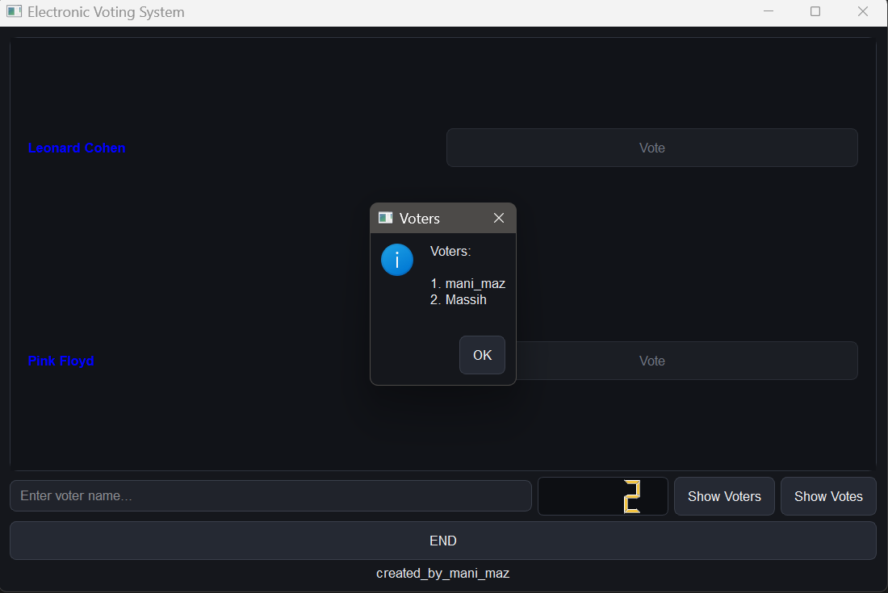
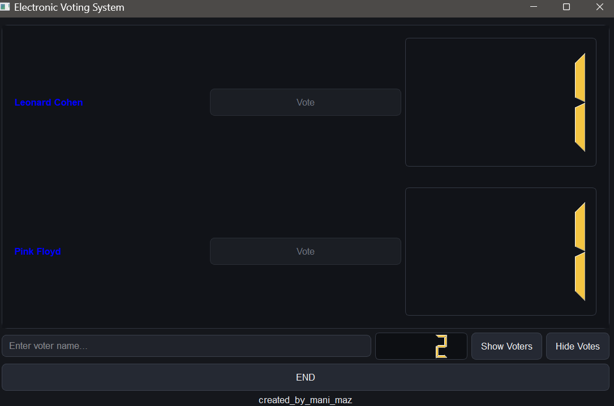
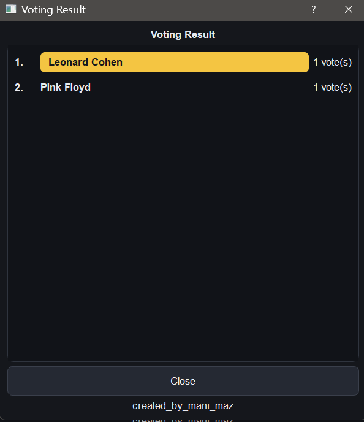

Markdown# Electronic Voting System / سیستم رای‌گیری الکترونیکی

[English](#english) | [فارسی](#فارسی)

---

## English

A simple, clean, and user-friendly **desktop Electronic Voting System** built with **Python** and **PyQt5**.

Perfect for small elections, classroom votes, clubs, or local events.

### Features

- Welcome screen with modern dark theme
- Configurable number of candidates (1–1000)
- Choose how many top winners to highlight
- Limit votes per voter (lock after N votes)
- Add / remove candidate names easily
- Voter registration by name
- One vote per candidate per voter (no double voting)
- Automatic lock after reaching the vote limit
- Show / hide live vote counts
- View list of all registered voters
- Final ranked results with highlighted winners
- Fully offline (no internet required)
- Dark modern UI

### Screenshots

| Welcome Screen | Election Setup |
|:---:|:---:|
|  |  |

| Candidates | Delete Candidate |
|:---:|:---:|
|  |  |

| Voting Menu | Show Voters |
|:---:|:---:|
|  |  |

| Show Votes | Final Results |
|:---:|:---:|
|  |  |

### Requirements

- Python 3.8 or higher
- PyQt5

### Installation

```bash
# Clone the repository
git clone https://github.com/mani-maz/electronic-voting-system.git
cd electronic-voting-system

# (Optional) Create a virtual environment
python -m venv venv
source venv/bin/activate        # Linux / macOS
# venv\Scripts\activate         # Windows

# Install dependencies
pip install -r requirements.txt
How to Run
Bashpython voting_system.py
Download Ready-to-Use Version (Windows)
You can download the pre-built .exe file from the Releases section.
How to Use

Welcome Screen → Click Continue
Nomination Screen
Set number of candidates
Set number of winners to highlight
Set maximum votes allowed per voter
Enter candidate names (press Enter after each name)
You can delete the last candidate or view the list
Click Start Voting

Voting Screen
Enter voter name and press Enter
Click on candidates to vote (each candidate can be selected only once)
After reaching the vote limit, voting locks automatically
Use Show Votes / Hide Votes to toggle live counts
Use Show Voters to see the list of voters
Click END when voting is finished to see the final ranked results


Project Structure
textelectronic-voting-system/
├── voting_system.py      # Main application
├── requirements.txt      # Dependencies
├── LICENSE               # MIT License
├── .gitignore
├── screenshots/          # Application screenshots
└── README.md             # This file
License
This project is licensed under the MIT License — see the LICENSE [blocked] file for details.
Author
mani_maz

Created with ❤️

## فارسی

<div dir="rtl" align="right">

یک سیستم رای‌گیری الکترونیکی دسکتاپ، ساده و کاربرپسند که با Python و PyQt5 توسعه داده شده است.

این برنامه برای انتخابات کوچک، رأی‌گیری‌های کلاسی، باشگاه‌ها و رویدادهای محلی مناسب است.

### ویژگی‌ها

* صفحه خوش‌آمدگویی با رابط کاربری تاریک و مدرن
* امکان تعیین تعداد نامزدها از ۱ تا ۱۰۰۰ نفر
* تعیین تعداد برندگان برتر برای هایلایت در نتایج
* تنظیم محدودیت تعداد رأی برای هر رأی‌دهنده
* افزودن و حذف آسان نام نامزدها
* ثبت نام رأی‌دهندگان
* جلوگیری از رأی‌دادن چندباره به یک نامزد توسط یک رأی‌دهنده
* قفل خودکار رأی‌گیری پس از رسیدن به حد مجاز رأی
* امکان نمایش و مخفی‌کردن تعداد رأی‌های نامزدها
* مشاهده فهرست رأی‌دهندگان ثبت‌شده
* نمایش نتایج نهایی به‌صورت رتبه‌بندی‌شده با مشخص‌کردن برندگان
* قابلیت اجرا به‌صورت کاملاً آفلاین و بدون نیاز به اینترنت
* رابط کاربری مدرن با تم تاریک

### تصاویر برنامه

|                         صفحه خوش‌آمدگویی                         |                تنظیمات انتخابات                |
| :--------------------------------------------------------------: | :--------------------------------------------: |
|  |  |

|                  فهرست نامزدها                 |                        حذف نامزد                       |
| :--------------------------------------------: | :----------------------------------------------------: |
|  |  |

|                   صفحه رأی‌گیری                  |                   فهرست رأی‌دهندگان                  |
| :----------------------------------------------: | :--------------------------------------------------: |
|  |  |

|                        نمایش تعداد رأی‌ها                       |                   نتایج نهایی                  |
| :-------------------------------------------------------------: | :--------------------------------------------: |
|  |  |

### پیش‌نیازها

* Python نسخه ۳.۸ یا بالاتر
* کتابخانه PyQt5

### نصب و راه‌اندازی

ابتدا مخزن پروژه را دریافت کنید:

```bash
git clone https://github.com/mani-maz/electronic-voting-system.git
cd electronic-voting-system
```

در صورت تمایل، یک محیط مجازی ایجاد کنید:

```bash
python -m venv venv
```

فعال‌سازی محیط مجازی در ویندوز:

```powershell
venv\Scripts\activate
```

فعال‌سازی محیط مجازی در لینوکس و macOS:

```bash
source venv/bin/activate
```

سپس وابستگی‌های موردنیاز را نصب کنید:

```bash
pip install -r requirements.txt
```

### نحوه اجرا

```bash
python voting_system.py
```

### دانلود نسخه آماده ویندوز

اگر نمی‌خواهید Python و کتابخانه‌های موردنیاز را به‌صورت دستی نصب کنید، می‌توانید فایل اجرایی ویندوز با پسوند `.exe` را از بخش Releases دریافت کنید.

[مشاهده نسخه‌های منتشرشده و دانلود برنامه](https://github.com/mani-maz/electronic-voting-system/releases)

### راهنمای استفاده

#### صفحه خوش‌آمدگویی

برنامه را اجرا کنید و روی دکمه Continue کلیک کنید.

#### صفحه تنظیمات انتخابات

* تعداد نامزدها را مشخص کنید.
* تعداد برندگان موردنظر برای هایلایت را تعیین کنید.
* حداکثر تعداد رأی مجاز برای هر رأی‌دهنده را تنظیم کنید.
* نام نامزدها را وارد کنید و پس از هر نام، کلید Enter را بزنید.
* در صورت نیاز، آخرین نامزد را حذف کنید یا فهرست نامزدها را مشاهده کنید.
* برای شروع رأی‌گیری، روی Start Voting کلیک کنید.

#### صفحه رأی‌گیری

* نام رأی‌دهنده را وارد کنید و Enter بزنید.
* با کلیک روی نام نامزدها، رأی خود را ثبت کنید.
* هر رأی‌دهنده می‌تواند به هر نامزد حداکثر یک بار رأی بدهد.
* پس از رسیدن به محدودیت تعیین‌شده، سیستم به‌طور خودکار قفل می‌شود.
* از دکمه Show Votes / Hide Votes برای نمایش یا مخفی‌کردن تعداد رأی‌های نامزدها استفاده کنید.
* با دکمه Show Voters می‌توانید فهرست رأی‌دهندگان را مشاهده کنید.
* پس از پایان رأی‌گیری، روی END کلیک کنید تا نتایج نهایی نمایش داده شوند.

### ساختار پروژه

```text
electronic-voting-system/
├── voting_system.py
├── requirements.txt
├── LICENSE
├── .gitignore
├── screenshots/
└── README.md
```

* `voting_system.py` — فایل اصلی برنامه
* `requirements.txt` — وابستگی‌های پروژه
* `LICENSE` — مجوز انتشار پروژه
* `.gitignore` — فایل‌های مستثنا از Git
* `screenshots/` — تصاویر برنامه
* `README.md` — مستندات پروژه

### مجوز انتشار

این پروژه تحت مجوز MIT منتشر شده است. برای اطلاعات بیشتر، فایل [LICENSE](LICENSE) را مطالعه کنید.

### نویسنده

مانی (mani_maz)

ساخته‌شده با ❤️

</div>

